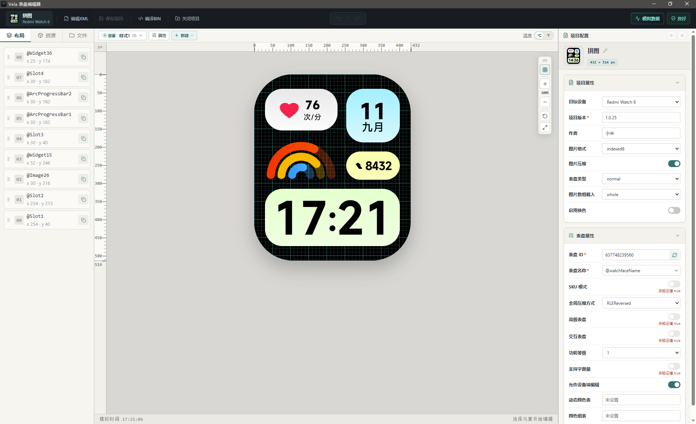

# Vela 表盘编辑器 (VelaWatchFaceEditor)

  <strong>适用于 VelaOS 可穿戴设备的表盘编辑器</strong>

  
  
  
  
  
  

  

---

## ⚠️ 已知问题 (Known Issues)

> ### **目前仅在【红米手表 6 (Redmi Watch 6)】上完成实机测试与验证！**
>
>
> - 📱 **作者仅有红米手表 6**：由于作者目前仅有 **红米手表 6 (Redmi Watch 6)** 这一台实体真机。因此，从设计排版、属性配置、Web Worker 编译到 `.bin` 导入实机的全流程，**目前仅在红米手表 6 上通过了完整测试与实机验证**。
> - 🔍 **其余机型兼容性需自行探索**：项目中预置的其它 15+ 款设备（如小米手表 S 系列、小米手环 8/9/10 系列、Redmi Watch 3/4/5 系列等）的规约配置均基于官方公开样本逆向反推，**尚未经实体真机逐一烧录验证**。由于各机型固件版本与渲染实现可能存在细微差异，**实际兼容情况需要使用者自行尝试与探索**。

---

## 📚 技术规范与工程文档

> ⚠️ **重要声明**：以下各篇底层技术规范、封包协议与 XML 语义解析文档，**均系基于公开样本与固件，通过 AI 辅助逆向工程与反推分析整理得出，并非小米官方发布的正式说明文档**。仅供技术学习、逆向研究与社区开发参考。

- 🛠️ **[源码工程与运行构建指南](./src/README.md)**：包含开发调试、Tauri 桌面端便携编译、脚本使用及 16 款设备清单；

- 📐 **[系统架构与分层边界](./docs/architecture.zh-CN.md)**：系统三层解耦与原生桥接架构；
- 📱 **[设备定义规范](./docs/device-definition-spec.zh-CN.md)**：16 款设备规约、能力收窄与扩展边界；
- 📋 **[manifest.xml 格式定义规范](./docs/format-definition-spec.zh-CN.md)**：XML 节点、属性规约与语义检查机制；
- 📜 **[manifest.xml 格式解析规范](./docs/manifest-xml-format.zh-CN.md)**：标签定义、坐标空间与表达式语法；
- 📦 **[resource.bin 二进制格式规范](./docs/resource-bin-format.zh-CN.md)**：0x30 头部、0x40 条目与 32 字节对齐机制；
- 🖼️ **[图像编码与量化研究](./docs/image-encoding-research.zh-CN.md)**：WuQuant 调色板算法与无损图像存储方案。

---

## 📄 开源协议与免责声明

- 本项目遵循 **[GNU General Public License v3.0 (GPL-3.0)](./LICENSE)** 开源协议。
  - 任何人均可自由获取、使用与修改本项目源代码；
  - **传染性约束 (Copyleft)**：凡基于本项目进行的二次开发、功能修改、衍生作品或编译分发版本，**均必须同样遵循 GPL-3.0 协议开源其全部源代码**，严禁将本项目核心逻辑闭源化或转化为私有商业闭源软件。
- **免责声明**：本项目为第三方逆向工程与表盘制作工具，仅供个人学习与技术交流。项目与小米集团（Xiaomi Corporation）无官方隶属或商业关联。“Xiaomi”、“Redmi”、“Vela”等商标权益归属原权利人。
